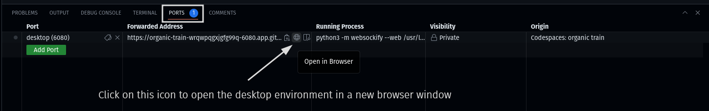

# SheCodespaces for Python 

This repository contains a pre-configured codespace with Python 3.12, a lightweight desktop environment, and Visual Studio Code for the Web -- all accessible from a web browser.

This is all you need to get started building the Turtle Chomp game. :turtle:

## Getting Started

Click the badge below to create a codespace and start coding. :rocket:

## Running the game

1. To run your code, right-click on your file then select `Run in Python > Run Python File in Terminal`.

2. The next step is to connect to the desktop where the game will be running. Follow the instructions below.

 - Open the `Ports` view, select the `Desktop` port, and click the Globe icon.

 - In the browser window that appears, click the *Connect* button and enter the desktop password (`vscode` by default).

## Managing codespaces

You can manage your codespaces (e.g. create new, resume or stop existing ones) at [github.com/codespaces](https://github.com/codespaces).
